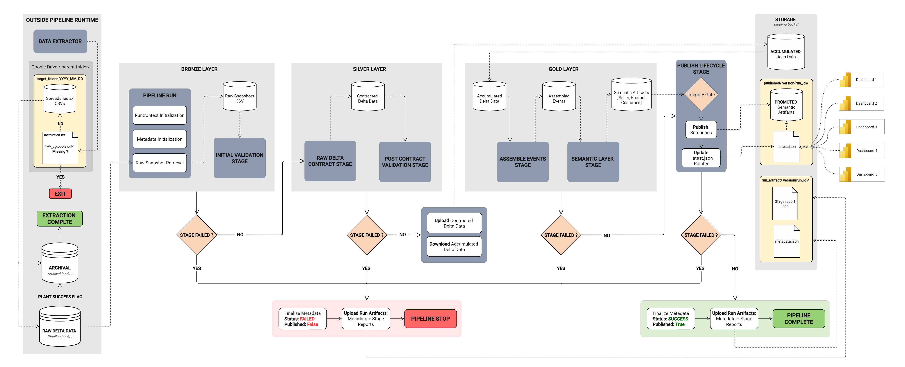
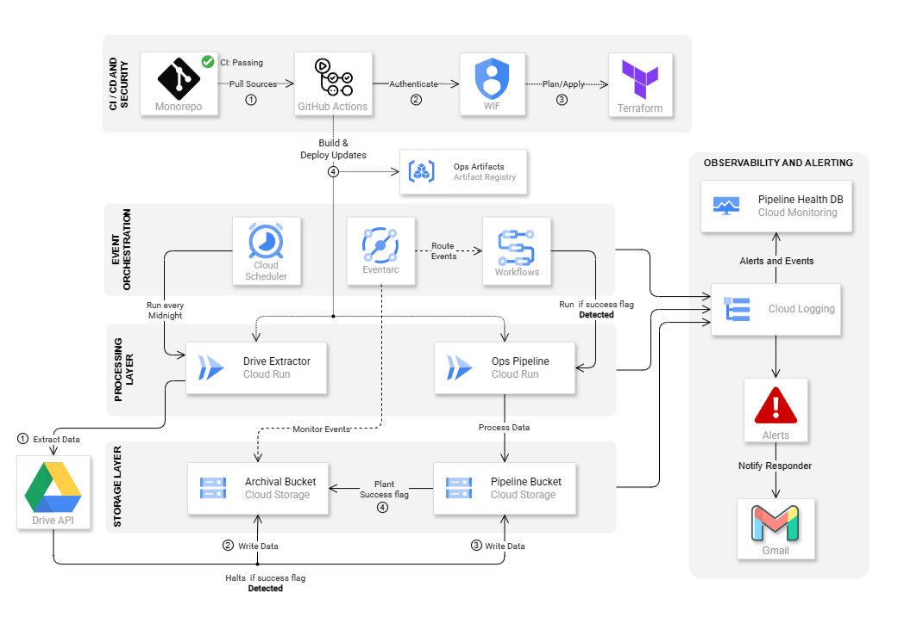
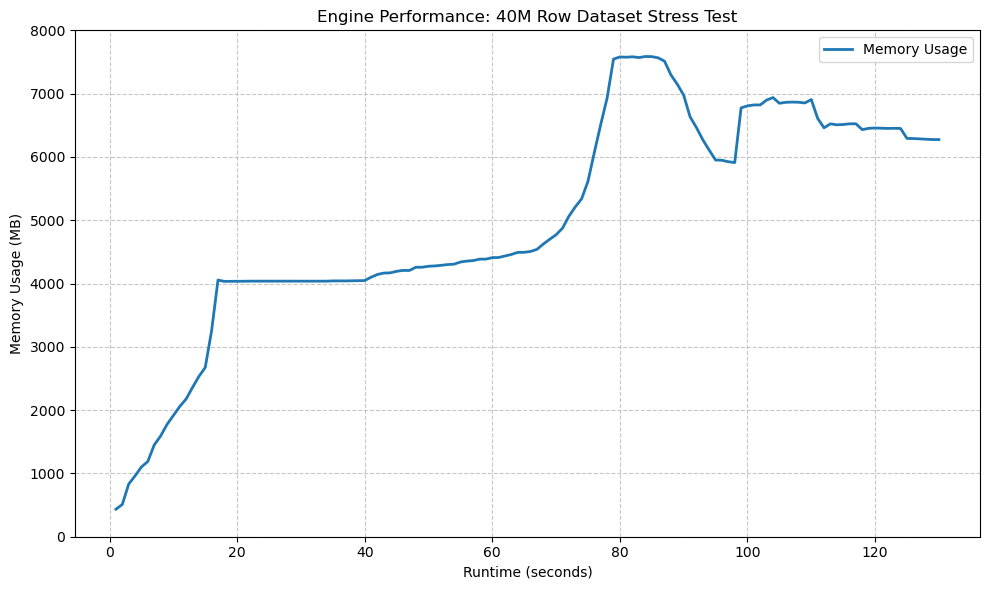
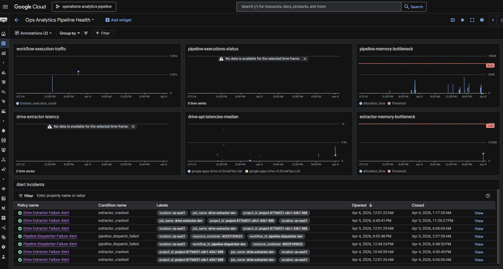
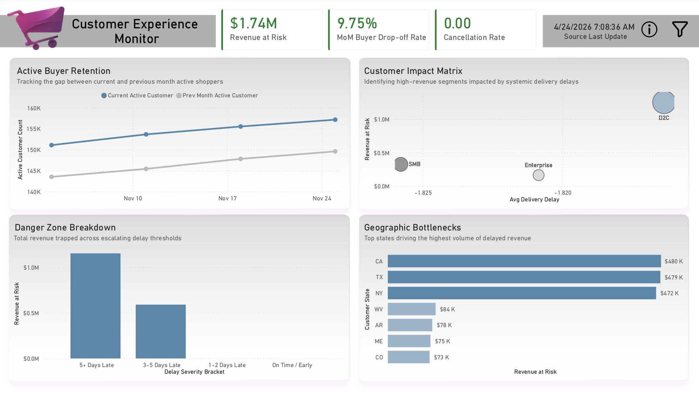
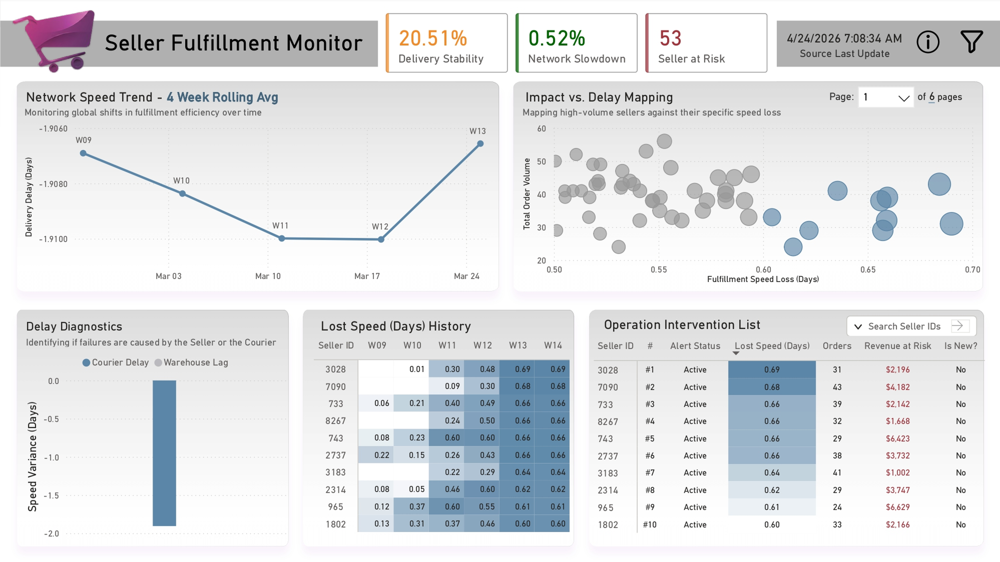
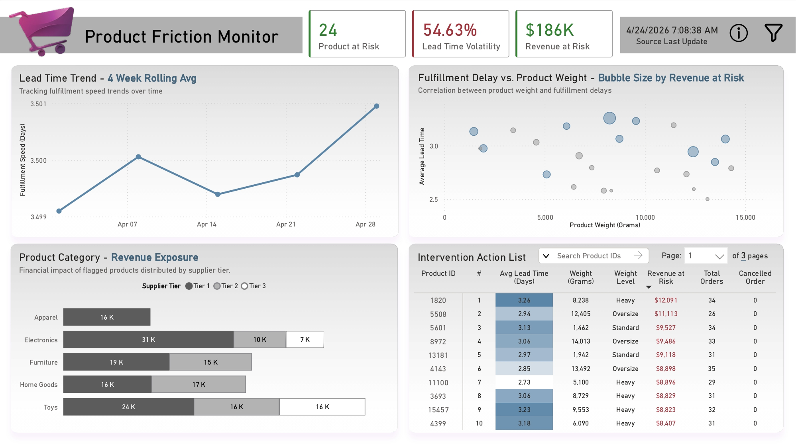

# Operations Analytics Pipeline: Scalable Integrity Engine

[](https://github.com/BLMgithub/operations-analytics-pipeline/actions/workflows/ci-code.yml)
[](https://github.com/BLMgithub/operations-analytics-pipeline/actions/workflows/ci-infra.yml)
[](https://github.com/BLMgithub/operations-analytics-pipeline/actions/workflows/cd-pipeline.yml)
[](https://github.com/BLMgithub/operations-analytics-pipeline/actions/workflows/cd-extract.yml)

## Overview
Organizations outgrowing spreadsheet-based workflows often face technical barriers when migrating to relational databases. This transition can lead to inconsistent data structures that limit scaling and reduce reporting reliability.

## System Architecture: Event-Driven Integrity

This project delivers a highly resilient, event-driven data pipeline on Google Cloud Platform designed to defend analytical integrity through a strict Medallion architecture and automated validation gates.

### Isolated Stateless Orchestration


To eliminate the risk of cross-run data contamination and memory exhaustion, the system employs isolated execution environments where local compute state is strictly temporary:
* **Stateless Workspace:** Each run operates in a deterministic `run_id` workspace cleared immediately after completion.
* **Memory-Optimized Joins:** Maps 36-byte UUID strings to 4-byte UInt32 surrogates, reducing join-key memory overhead by ~16x to maintain serverless resource limits.
* **Cloud-Native Sync:** After processing the Silver (Contract) layer, the system syncs results to Cloud Storage and purges the local environment.
* **Linear Integrity Gating:** Stages are strictly gated; failure at any tier (Ingestion, Contract, or Assembly) stops downstream processing to prevent the promotion of partial or malformed data.
* **Lazy Streaming Engine:** Leverages the Polars Rust engine to process large-scale datasets within the strict memory constraints of serverless Cloud Run instances.

### Serverless Infrastructure & Eventarc Triggers


The underlying infrastructure is entirely serverless, decoupled, and codified via Terraform:
* **Orchestrated Extraction:** Cloud Scheduler initiates daily extraction via Cloud Run, separating the extraction layer from the main processing logic.
* **Event-Driven Dispatch:** Eventarc monitors Cloud Storage for `.success` flags, triggering the main processing job via Cloud Workflows only when extraction succeeds.
* **Zero-Trust Deployment:** GitHub Actions leverage Workload Identity Federation (WIF) for secure, keyless deployments of all infrastructure and containerized jobs.

## Data Defense: The Registry Rule Engine

The pipeline actively manages upstream anomalies by enforcing a Medallion architecture governed by a registry-driven validation suite.

**Bronze (Raw Snapshots)**
* **Role:** Immutable snapshots of source systems. Data here is assumed to be structurally untrustworthy, containing nulls, duplicates, or orphaned records.

**Silver (The Contract Layer)**
* **Primitive Integer Pipeline:** Maps 36-byte UUID strings to 4-byte UInt32 surrogates. This reduces  join-key memory overhead by ~16x and ensuring the pipeline stays within serverless memory constraints.
* **Subtractive-Only Logic:** The pipeline never guesses or "repairs" bad data. Records violating the contract are explicitly dropped and logged in the telemetry report.
* **Cascade Cleanup:** The system tracks invalidated parent IDs and propagates drops downstream, ensuring child records (like line items) are removed to prevent orphaned data in joins.
* **Schema Enforcement:** Output files are strictly cast to predefined types and projected to approved columns before storage.

**Gold (The Semantic Layer)**
* **Assembly Stage:** Integrates normalized relational tables into a unified analytical dataset, enforcing a 1:1 grain per order.
* **Semantic Stage:** Transforms events into specialized Fact and Dimension modules tailored for entity-centric analysis (Sellers, Customers, Products).
* **Strict Grain Enforcement:** Fact tables are deterministically aligned to an ISO-Week grain (`W-MON`) with exactly one row per `(Entity_ID, order_year_week)`.

### Integrity Gates & Atomic Deployment

* **Dual-Pass Validation Strategy:**
    * **Initial Raw Gate:** Evaluates raw snapshots. Structural warnings are tolerated but passed to the Silver stage for subtractive cleanup.
    * **Post-Contract Silver Gate:** Re-validates data after contract rules are applied. Remaining warnings are escalated to fatal errors, triggering a `RuntimeError` to stop downstream corruption.
* **Atomic BigQuery Publishing:** Final semantic models are delivered via Authorized Views that atomically swap pointers to new data versions. This ensures BI tools always query complete, validated datasets with no downtime during updates.

## Performance & Scalability (Cloud-Native Benchmarks)

By leveraging the Polars Rust engine (Lazy API), the system achieves near-optimal resource utilization within the rigid memory constraints of serverless compute.

### GCP Stress-Test Metrics

| 40M Snapshot (8GB / 4 vCPU) |
| :---: |
|  |

| Metric | Data | 
|:---|:---|
| Dataset | ~40 Million Rows / ~5.3 GB Parquet |
| Provision Spec | 8 GB RAM / 4 vCPU |
| Efficiency (Processing) | ~307k Rows / Second |
| Total Runtime (Wall-Clock) | 130 Seconds |

*   **Maximized Memory Density:** The **Primitive Integer Pipeline** allows a ~5.34GB analytical model to process within the 8GB RAM limit by shrinking join-key overhead by ~16x.
*   **Near-Linear Performance Scaling:** The engine saturates available vCPUs, yielding high throughput during streaming execution.
*   **Zero-Idle Economics:** 100% serverless execution ensures zero billable time during idle periods.

### Measurement Methodology
*   **Performance Profiling:** Captured from production telemetry via the pipeline's native `run_duration` metadata, calculating the precise delta between `started_at` and `completed_at` timestamps.
*   **Memory Utilization:** Monitored via an integrated [`psutil.virtual_memory().used`](assets/benchmarks/polars/) profiling implementation to verify the actual resource footprint and confirm the physical ceiling for 8GB provision.

### **Scaling Roadmap: From Serverless to Enterprise Lakehouse**

#### **Stage 1: Incremental Delta Propagation**
*   **Strategy:** Transition to a "Stateless Delta Propagation" model using Polars' streaming engine to process only new `.parquet` deltas, reducing I/O and CPU time by 80-90%.

#### **Stage 2: Event-Driven Real-Time Streaming**
*   **Strategy:** Integrate GCS Pub/Sub notifications with Cloud Run streaming sinks to trigger sub-minute validation and assembly as files are uploaded.

#### **Stage 3: BigQuery "Engine-as-a-Service"**
*   **Strategy:** Offload high-volume compute layers entirely to BigQuery using SQL-driven logic. Provides petabyte-scale capacity while the Python pipeline manages integrity gates.

## System Health & Observability



The pipeline features a comprehensive observability suite managed natively via Google Cloud Monitoring and Cloud Logging, codified entirely in Terraform.

### Monitored Telemetry & Alerting
The system tracks granular operational metrics to proactively identify resource bottlenecks and execution failures:

* **Pipeline Job Metrics:** Tracks execution status (Success/Fail), workflow traffic, and memory allocation bottlenecks against the 8GB threshold.
* **Extractor Job Metrics:** Monitors Drive API latencies and instance billable time to track API usage costs.
* **Automated Responders:** Dispatches `CRITICAL` email alerts for ingestion failures, extractor crashes, or pipeline fatal errors (OOMs), ensuring debuggability through resilient lineage tracking.

## Operational Intelligence: BI Decision Support

This architecture serves the Presentation Layer with high reliability, ensuring that dashboards are built upon validated, semantically flattened data models.

> **Dynamic Sensitivity Calibration**
>
>The reporting suite features interactive "Smoke Detectors." Built with dynamic What-If parameters, these dashboards allow operators to manually adjust alert sensitivity thresholds to match changing business realities.
>
> Explore the  **[Power BI Directory](/power_bi)** to read detailed [operational guides](power_bi/docs) or download the `.pbix` [releases](power_bi/releases/).

### Customer Experience & Revenue Exposure
Monitors financial risk by correlating delivery delays with buyer drop-off rates, allowing leadership to quantify the "cost of friction."



### Fulfillment Decision Monitor
An operational early-warning system focusing on statistical deviations in network speed rather than total failure to identify partners requiring intervention.



### Product Friction Monitor
Identifies structural fulfillment bottlenecks driven by product specifications (e.g., weight outliers) to route items to specialized freight.



## CI/CD & Security

The project adheres to a strict **Zero-Trust** deployment model. 

* **Workload Identity Federation (WIF):** Authenticates GitHub Actions to Google Cloud via short-lived OIDC tokens.
* **Infrastructure as Code:** IAM bindings and infrastructure are strictly managed via automated Terraform workflows.
* **Containerized Artifacts:** Codebases are packaged into Docker images and pushed to the GCP Artifact Registry only after passing CI checks.


## Repository Structure

```
operations-analytics-pipeline/
├── .gcp/
│   └── terraforms/         # IaC for all GCP resources (Cloud Run, Eventarc, Storage, IAM)
├── .github/
│   └── workflows/          # CI/CD pipelines (Terraform apply, Docker build/push, Code quality & test)
├── assets/
│   └── benchmarks/         # Performance profiling logs (Pandas vs Polars memory usage)
├── data/                   # Git-ignored local directories used when simulating cloud storage
│   ├── raw/                # Extracted snapshot dumps
│   ├── contracted/         # Intermediate Silver-layer files
│   ├── published/          # Final Gold-layer analytical models
│   └── run_artifact/       # Lineage metadata and stage execution logs
├── data_extract/
│   ├── shared/             # Extractor logic and core I/O utilities
│   └── run_extract.py      # The Drive extractor orchestrator
├── data_pipeline/
│   ├── .shared/            # Storage adapters, IO wrappers, and registry configurations
│   ├── assembly/           # Delta merging and event mapping logic
│   ├── contract/           # Subtractive filtering logic (Silver Layer)
│   ├── publish/            # Manages the atomic publish lifecycle of semantic datasets
│   ├── semantic/           # Fact/Dimension table builders (Gold Layer)
│   ├── validation/         # Dual-pass structural data validation gates
│   └── run_pipeline.py     # The pipeline orchestrator and state manager
├── docs/                   # Detailed architectural and stage-level system contracts
├── runtime/                # Git-ignored ephemeral workspace used by the local pipeline executor
├── tests/                  # Pytest suite for pipeline logic and validation rules
└── power_bi/
    ├── .shared/            # Global Dashboards BI assets (e.g. Themes, .json files, etc.)
    ├── dashboards/         # Source Control (PBIP) 
    └── releases            # Deliverables (PBIX)
```